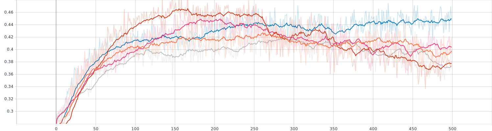
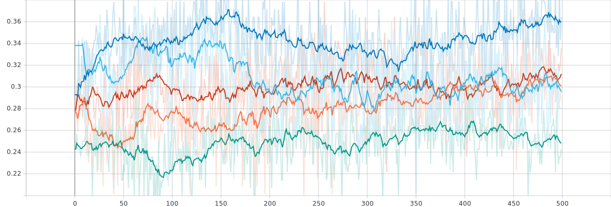
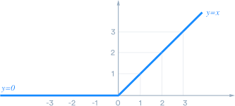
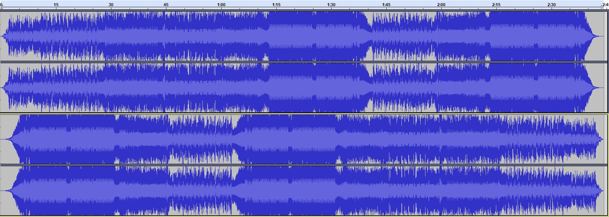

```{r Setup, include=FALSE}
knitr::opts_chunk$set(echo = FALSE)
#knitr::opts_chunk$set(fig.width = 10, fig.height = 5)

library(ggplot2)
library(plotly)
library(tidyverse)
library(reshape2)
library(factoextra)
library(cluster)
library(spotifyr)
library(grid)
library(gridExtra)
library(compmus)
library(caret)
library(keras)
#library(formattable)
library(ramify)
library(e1071)
library(kableExtra)


load("spotify_env_vars.RData")
load("data/all_songs.RData")
SetEnvVars()

#save(all_songs, file='data/all_songs.RData')
```

The Update (Week 12)
===


Introduction
===

Column
---

### The Idea
For my project I'm going to do research in the genre of hardstyle music.
A lot of people would say that the music within this genre is all alike. However there is a common assumption that each artist distinguishes him- (or her)self with his (or her) unique style and sound. This is most noticable in the tones used in the so called _drop_ and as bass-kick.

I'm going to research whether this assumption can be proved with a (computer)model. In particular a classification model that can classify a song with an artist (assumed that this song is of one of the artists used for training the model). Because if such model can be used we can assume that indeed there is something in the songs that are unique for each artist.
However if such model is not possible, I'm going to research why this is the case, or what is necessary to create such model.

Column
---

### The Corpus
To do this research we obviously need some data to work with.
For this I'm going to use the songs from the top 5 hardstyle artists together with the songs of my 2 most favorite artists.
Together this gives me a corpus of 698 songs where each artist has about 50 songs or more.
This should be enough data to build a decent classification model.

Artist             | Songs on Spotify
:-----------------:|:----------------:
Noisecontrollers   | 199
Headhunterz        | 146
Brennan Heart      | 100
Showtek            | 88
Da Tweekaz         | 62
Sub Zero Project   | 56
D-Block & S-te-Fan | 47

The Data {.storyboard}
===

### __Data Understanding__<br/>In this section I do a quick exploration of the data. I look if there may be already some patterns. {data-commentary-width=550}
```{r Violinplots}
create_violin <- function(cat, catstr){
  plt <- ggplot(all_songs, aes(x=num, y=cat, fill=artist_name, col=artist_name)) +
    geom_violin() +
    labs(fill='Artist', color='Artist', title=paste('Violinplot of', catstr)) +
    ylab(catstr) +
    theme_minimal() +
    theme(axis.title.x=element_blank(),
          axis.text.x=element_blank(),
          axis.ticks.x=element_blank())
  if (catstr == 'Danceability'){plt <- plt + theme(legend.position = 'left')}
  else if (catstr == 'Tempo') {plt <- plt + theme(legend.position = 'right')}
  else {plt <- plt + theme(legend.position = 'none')}
  #print(plt)
  plt
}

create_violin(all_songs$danceability, 'Danceability')
create_violin(all_songs$energy, 'Energy')
ggplot(all_songs, aes(x=key, fill=artist_name)) + geom_histogram(bins=12) + 
  labs(fill='Artist', title='Histograms of Key') +
  xlab('Key') +
  ylab('Count') +
  facet_grid(~ artist_name) + 
  theme(strip.text=element_text()) +
  theme_minimal() +
  theme(legend.position='none')
create_violin(all_songs$loudness, 'Loudness')
ggplot(all_songs, aes(x=mode, fill=artist_name)) + geom_histogram(bins=2) + 
  labs(fill='Artist', title='Histogram of Mode') +
  xlab('Mode') +
  ylab('Count') +
  facet_grid( ~ artist_name) +
  scale_x_continuous(breaks=c(0,1)) +
  theme(strip.text=element_text()) +
  theme_minimal() +
  theme(legend.position='none')
create_violin(all_songs$speechiness, 'Speechiness')
create_violin(all_songs$acousticness, 'Acousticness')
create_violin(all_songs$instrumentalness, 'Instrumentalness')
create_violin(all_songs$liveness, 'Liveness')
create_violin(all_songs$valence, 'Valence')
create_violin(all_songs$tempo, 'Tempo')
#ggplot(all_songs, aes(x=num, y=tempo)) +
#  geom_point() +
#  labs(color='Artist', title='Scatterplot of Tempo') +
#  ylab('Tempo') +
#  theme_minimal() +
#  theme(axis.title.x=element_blank(),
#        axis.text.x=element_blank(),
#        axis.ticks.x=element_blank())
```

***

#### Data Understanding
Before trying to build a classifier we first need to do some exploration on and understanding of the data.
In the first place we need to decide which information we are going to use for the classifier.
For example the genre for each artist probably will be similar and thus will not be useful data.
Furthermore we have two possible sets of features we can use to train the classifier with:

* _Track Features_, these features are returned by the `get_track_audio_features()` method of the `spotifyr` package. This method is also used to get the track features in the `get_artist_audio_features()` and `get_album_audio_features()` methods.
  These features are values that say something about the song in a whole, thus we will get 1 feature value per song.
* _Track Analyis_, these features are obtained using the `get_track_audio_analysis()` method fromt the `spotifyr` package.
The analysis features are quite a bit more extensive than the track features, thus will probably contain a lot more information about the song. However this means more data, which will take up more disk space, take longer to obtain from Spotify, make the classifiation training take more time and make the model quite a bit more complex (since we now need to add a time dimension to our model).

Because of the reasons described above I'm first going to focus on creating a model created with the _track features_. 
If I fail to create a good model with these features I'm going to take a look at the _track analysis_ features.

The track features include many features including the following numeric features that may be useful:

* Danceability
* Energy
* Key
* Loudness
* Mode
* Speechiness
* Accousticness
* Instrumentalness
* Liveness
* Valence
* Tempo

This is a lot of data in which some features may be very similar for all songs. It is useless to include this data in the trainingsdata for the classifier since it wouldn't provide good information to distinguish two songs from each other, let alone different artists.

To give a good insight in these features and get a quick overview of which of these may be show some clear differences between the artists, I have combined all songs from all artists into one dataset. I have plotted each of them here (I would have made them interactive however due to limitations of the _plotly_ package they are just images. From these plots you can observe that the _Mode_ feature is not useful. Some other features don't seem to show any clear patterns on their own too. That is why I have plotted each feature relative to the other features. If one of these plots already show clusters we probably only need to use these two features to train a classifier with. However I have put these plots in a separate [document](https://github.com/Saltpile123/CM_Portfolio/blob/master/plots/All_features_relative.md) because of the amount (121) and because no plot seems to show any clear clusters.

So although the scatterplots did seem to show some nice patterns, these patterns seem to be very similar among the artists.
This thus means we need to perform Principal Component Analysis.
I will elaborate more on this in the Data Preparation section. If the PCA provides us with good clusters we know that we can quite easily build a classifier, however if the PCA doesn't provide us with any noticable clusters it may be possible that the data still can be clustered, but in higher dimensions. This, however, is quite hard to visualize, thus then I will probably just feed the data to the classifier and hopefully it will be able to draw relations between the features and the artist.


### __Data Preparation__ (Dimensionality Reduction)<br/>Not all data is useful for a classifier, therefore we need to reduce the dimensionality of our dataset. {data-commentary-width=750}
```{r PCA & Clusters, fig.width=10, fig.align='center'}
all_songs_pca <- prcomp(all_songs[,1:11])
plt_pca <- ggplot(all_songs, aes(all_songs_pca$x[,1], all_songs_pca$x[,2], col=all_songs$artist_name)) + 
  geom_point() +
  labs(color='Artist', title='Figure 1: PC2 plotted against PC1') +
  xlab('Frist Principal Component') +
  ylab('Second Principal Component')

pam_feat <- pam(all_songs[1:11], 7)
pam_pca <- pam(all_songs_pca$x, 7)

feat_plt <- fviz_cluster(pam_feat, data=all_songs[1:11], geom='point', main='Figure 2: K-Means on Track Features')
#plotly_build(feat_plt)

pca_plt <- fviz_cluster(pam_pca, data=all_songs_pca$x, geom='point', main='Figure 3: K-Means on Principal Components')
#plotly_build(pca_plt)

plt_pca
#feat_plt
#pca_plt

grid.arrange(feat_plt, pca_plt, nrow=1)
```
```{r}
all_songs_vari <- varimax(all_songs_pca$x)
ggplot(all_songs_vari)
```
```{r}
ggplotly(plt_pca)
```
```{r}
ply_pca <- plot_ly() %>% 
  add_trace(
    type="scatter3d",
    x=all_songs_pca$x[,1],
    y=all_songs_pca$x[,2],
    z=all_songs_pca$x[,3],
    color=pam_pca[["clustering"]],
    text=all_songs$track_name,
    #hoverinfo='text',
    hovertemplate=paste('Artist: %{color}', '<br>Track: %{text}</br>'),
    size=I(50)
  ) %>% 
  layout(
    title="Plot of first 3 principal components",
    scene = list(
      xaxis=list(title="PC1"),
      yaxis=list(title="PC2"),
      zaxis=list(title="PC3")
    )
  )
ply_pca
```

```{r, eval=FALSE}
  plot_ly(x=all_songs_pca$x[,1], y=all_songs_pca$x[,2], z=all_songs_pca$x[,3], 
        type="scatter3d", color=pam_pca[["clustering"]], size=I(50))
```
***

#### Dimensionality Reduction
Before we can feed the data to the classifier we first need to prepare the data. One part of data preparation is data reduction. This means that we reduce the initial dataset to be only data we are going to use for the classifier.
Since we are going to use the track features we can all discard all data other than these features. I combined this data only into a new data frame and saved that as my new corpus. 
Previously I mentioned removing the _Mode_ feature from our data as well, however since we are now going to perform PCA I will keep this feature for now.
Of course we still need to include the _Artist_ in our reduced dataset since we need to use that data as classes for the model.

#### Principal Component Analysis
As mentioned in the Data Understanding we need to apply Principal Component Analysis on the data since the features on their own or relative to one other feature didn't show any good clusters. Principal component analysis means that we reduce the data to a new dataset where each column is an information rich column that captures as much possible variation from the initial data.
This data may be even better to use than the features on their own since the PCA data will be more dense in information, and will contain only the relevant parts of the features.
First of all I made a PCA of the data, I have plotted the first two against each other (see _Figure 1_).

As you can see, there is still no clear separation between the artists, if any we see that they all seem to be very close in terms of PC1 and PC2.
However since the PCA consists, in our case, of 11 principal components, we might not see all differences between the artists. Thus we need a way to see whether __all__ principal components can be used to desinguish the artists. 

#### K-Means Clustering
We can use clustering for this and k-means clustering in particular. This clustering algorithm first assigns each data point to a random cluster. Then it iteratively calculates the centerpoint of each cluster and assigns each data point to the cluster with the nearest centerpoint, this is done using some distance formula that handles multidimensional data (like Euclidean distance, Manhattan distance).
To compare the standard features with the principal components I have applied k-means clustering on both the features data and principal components data with 7 clusters (we have 7 artists). 

If the data can be effectively clustered we would see 7 separate circles, and in each cirlce there will be only one type of points.
However, as you can see in _Figure 2_ and _Figure 3_ (can be found interactive in the next to stories) most data points are all in one big cluster and the circles of all clusters all cross each other.
We do see that using the Principal Components as data for the clustering algorithm did help to separate one cluster from all others.
But if we examine this cluster we see that 6 out of the 7 artists have songs in this cluster. 

```{r Cluster 1}
unique(all_songs[pam_pca$clustering==1,][,12])
```

### __Figure 2__ (interactive)
```{r}
plotly_build(feat_plt)
```

### __Figure 3__ (interactive)
```{r}
plotly_build(pca_plt)
```

### __Further Analysis on the PCA__<br/>I look further into what features the Principal Components represent.

### __Creating the delta and delta delta data__<br/>As more advanced data I use the delta and delta delta timbre features of my corpus.

### __Data Preparation__ (Subsetting)<br/>Before we can train a classifier we need training- and testingdata. To reduce data loss I use cross validation.
#### Subsetting the data for the classifier
Since we are going to train a classifier we also need to seperate the data into two subsets:

* A trainingset, containing about 80% of the data. This data will be used to train the classifier.
* A testset, containing the remaining 20% of the data. This data will be used to test the classifier.

However, since taking only 20% of the data as validation data, this means we get only 140 songs to validate the classifier. In the best scenario this will mean 20 songs per artist, however since we don't have an equal amount of songs per artist we will most likely not get 20 songs per artist in the validation data.

#### K-Fold Cross Validation
For this reason I'm going to perform k-fold cross validation on the data with 5 folds. This means that I'm going to shuffle the data and then divide the data into 5 parts (thus each part is 20% of the data). After that I will repeatedly take one part as testset and the other parts as trainingset.
This way all data will be once testdata and 4 times trainingsdata, resulting in a model that has seen more data and thus is less overfitted on that data, giving a better estimate of the real performance of the model.

#### Preparing the _Track Features_ Data
The first data I am going to use to train a classifier are the _track features_.
What data is included in this can be found in [The Data]. 

To make sure each feature has the same impact on the model each feature must be scaled to be within the same limits. I choose to scale the data between 0 and 1.

```{r Preparing Data, echo=TRUE}
scale_01 <- function(x){(x-min(x))/(max(x)-min(x))}   # Define scale function
train_data <- apply(all_songs[,1:9], 2, scale_01)     # Scale track features data
```

Then I converted the artist names to a factor vector for the support vector machine and I created a one-hot-encoding matrix of the artist names for the Keras model.
A one-hot-encoding matrix is just a row of zeros with one 1 at the position of the true class.
Thus the one-hot-encoding vector for a song made by Noisecontrollers will contain only zeros and 1 one at the position of Noisecontrollers in the one-hot-encoding matrix like this:

```{r}
train_factors <- as.factor(all_songs$artist_name)     # Create factor vector for class labels
train_targets <- to_categorical(as.integer(as.factor(all_songs$artist_name)))   # Create one-hot-encoding matrix for class labels
train_targets <- train_targets[,2:8]                  # Get only the relevant columns
print(train_targets[1,])
```

Now we have prepared the data value wise we can now divide the data into folds.
To do this I first shuffle the indices of the data.
Then I create a vector with equal amount of items per fold. Lastly I assign to each index a fold.

```{r, echo=TRUE}
set.seed(123)   # Set a seed to make reproducible results
k <- 5          # Amount of folds
shuffled_indices <- sample(1:nrow(train_data))                          # Shuffle the indices
fold_breaks <- cut(1:length(shuffled_indices), breaks=k, labels=FALSE)  # Split the data into k equal parts
fold_indices <- fold_breaks[shuffled_indices]                           # Assign a fold to each index
```

Modeling {.storyboard}
===

### __Introduction__
#### Introduction
As mentioned before I'm going to train multiple models, trained on different subsets of the initial dataset:

* A model trained on all features mentioned in [The Data] (Data Understanding).
* (optionally) A model trained on (a subset of) the Principal Components.
* A model trained on deltas of timbre/chroma and/or delta delta of timbre/chroma.

Multiclass classification models can be made in different ways.
Because I am very intrigued by deep learning, I had the intention from the start to make a deep learning model to use for classification.
Deep learning comes in many packages but I already had heard of TensorFlow and especially its embedding in the [Keras library](https://keras.io/).
Keras originally is a deep learning library for the Python programming language, however I had seen a c# version as well.
When doing Datacamp courses I noticed a course called _Introduction to TensorFlow in R_ which included lessons for Keras in R.
So I looked into the Keras package for R and found that it works the same as Keras for Python except for some methods having other names.

Multiclass classification models can, however, be made a lot easier than creating a whole Keras model, namely with [Support Vector Machines](https://en.wikipedia.org/wiki/Support-vector_machine).
Especially since R provides very easy tools to create one.

That is why I decided to not only create a Keras model but also a Support Vector Machine as comparison model to see whether deep learning is better practice for this kind of classification, or if it is way easier (with maybe better results) to just create a support vector machine model.


### __SVM on Track Features__<br/>I create a support vector machine model on the Track Features data and assess its performance. {data-commentary-width=500}
```{r SVM Classifier (K-Fold CV), results='asis'}
svm_accuracies <- c()
for (i in 1:k){
  #print(paste('Fold:', i))
  #cat(paste("Fold :", i))
  cat("__Fold #", i, ":__  ")
  # Get all data rows of this fold
  inds <- which(fold_indices == i, arr.ind=TRUE)
  
  # Take these data rows as validation data
  val_x <- train_data[inds,]
  val_y <- train_factors[inds]
  
  # Take the other data rows as training data
  train_x <- train_data[-inds,]
  train_y <- train_factors[-inds]
  
  # Create a support vector machine model and assess its performance
  svm_model <- svm(x=train_x, y=train_y)
  predicted <- predict(svm_model, val_x)
  confusion <- confusionMatrix(predicted, val_y)
  acc <- confusion$overall["Accuracy"]
  svm_accuracies <- c(svm_accuracies, acc)
  print(acc)
  
  cf <- knitr::kable(table(predicted, val_y)) %>% 
    kable_styling("striped", full_width = T)
  print(add_header_above(cf, c("Predicted", "Actual"=7)))
  #print(knitr::kable(table(predicted, val_y)))
  cat("\n  ...  \n")
  cat("\n  ")
  #print(formattable(confusion$table))
}
cat("__Mean accuracy:__ ", mean(svm_accuracies))
#knitr::kable(tables[1], "html")
```

***

#### The Support Vector Machine Model
To compare the results of the deep learning model I have created a support vector machine on the same data.
This data includes the track features scaled to be in the range [0,1] and seperated into 5 parts.  
For each fold I created a new SVM model and used 4 parts of the data as trainingdata and the other part as validation data.

#### The Results
To assess the performance of each model I have created a confusion matrix of the results. I have put the accuracy above each confusion matrix. Each row gives the predicted label while each column stands for the actual label. This way we can see which artists were correctly classified most times and if an artist is classified incorrectly which other artist was choosen instead.
If a model has very high accuracy we would see only zeros with on diagonal line of numbers going from top left to bottom right.

If we look at the accuracies we see that each model roughly has the same accuracy, small differences between the accuracies are probably explained by each fold having a different distribution of songs per artist. The mean accuracy of all models is 36%, which is, considering the type of data, not that bad.

When looking at the confusion matrices we see that most of the inaccuracy of the models are explained by all of them classifying most songs as being from _Noisecontrollers_. Considering this artist having most songs in my corpus begs me to question whether this model actually 'learned' patterns in the data or just found out that guessing _Noisecontrollers_ most times was just the right answer. Especially if we look deeper into the confusion matrices we see that the second most predicted label is _Headhunterz_ who have, after _Noisecontrollers_, the most songs in my corpus.


### __Keras model on Track Features__<br/>Here I make a Keras deep learning model on the Track Features data.{data-commentary-width=600}
```{r Build Model Function, echo=TRUE}
build_model <- function() {
  model <- keras_model_sequential() %>%
    layer_dense(units=25, activation='relu', input_shape = 9) %>% # Fully connected input layer with 25 nodes
    layer_dense(units=15, activation='relu') %>%  # Second fully connected hidden layer with 15 nodes
    layer_dense(units=7, activation='softmax')    # Output layer with 7 nodes (7 classes)
  
  model %>% compile(
    optimizer = 'rmsprop',
    loss = 'categorical_crossentropy',
    metrics = c('accuracy')
  )
}
```

```{r Keras Model (K-Fold CV) with Tensorboard, eval=FALSE}
num_epochs <- 500
accuracy_histories <- c()
all_scores <- c()
for (i in 1:k) {
  cat("Processing fold #", i, "\n")
  # Prepare the validation data: data from partition # k
  val_indices <- which(fold_indices == i, arr.ind = TRUE) 
  
  # Get the training and validation data
  val_data <- train_data[val_indices,]
  val_targets <- train_targets[val_indices,]
  partial_train_data <- train_data[-val_indices,]
  partial_train_targets <- train_targets[-val_indices,]
  
  # Build the Keras model
  model <- build_model()
  
  #model %>% fit(partial_train_data, partial_train_targets,
                #epochs=num_epochs, batch_size=1, verbose=0)
  # Evaluate the model on the validation data
  #results <- model %>% evaluate(val_data, val_targets, verbose = 0)
  #print(paste("Loss:", results$loss, "Accuracy:", results$accuracy))
  #all_scores <- c(all_scores, results$accuracy)
  
  # Train the model (in silent mode, verbose=0)
  history <- model %>% fit(partial_train_data, partial_train_targets,
                epochs = num_epochs, batch_size = 1, verbose = 0,
                callbacks = callback_tensorboard(paste("logs/run_", i, sep="")),
                validation_data = list(val_data, val_targets))
  accuracy_histories <- rbind(accuracy_histories, history$metrics$val_accuracy)
} 
#tensorboard("logs")
#all_scores
average_accuracy_history <- data.frame(
  epoch=seq(1:ncol(accuracy_histories)),
  validation_accuracy=apply(accuracy_histories, 2, mean)
)
```
```{r, eval=FALSE}
all_accuracies <- data.frame(accuracy_histories)
all_accuracies <- data.frame(t(all_accuracies))
colnames(all_accuracies) <- c("Fold_1", "Fold_2", "Fold_3", "Fold_4", "Fold_5")
all_accuracies$x <- seq(1:nrow(all_accuracies))
all_accuracies_melted <- melt(all_accuracies, measure.vars=c("Fold_1", "Fold_2", "Fold_3", "Fold_4", "Fold_5"), id="x")
ggplot(all_accuracies_melted, aes(x=x, y=value, col=variable)) +
  geom_line()
```
```{r, eval=FALSE}
num_epochs <- 160
accuracy_histories <- c()
all_scores <- c()
for (i in 1:k) {
  cat("Processing fold #", i, "\n")
  # Prepare the validation data: data from partition # k
  val_indices <- which(fold_indices == i, arr.ind = TRUE) 
  
  # Get the training and validation data
  val_data <- train_data[val_indices,]
  val_targets <- train_targets[val_indices,]
  partial_train_data <- train_data[-val_indices,]
  partial_train_targets <- train_targets[-val_indices,]
  
  # Build the Keras model
  model <- build_model()
  
  model %>% fit(partial_train_data, partial_train_targets,
                epochs=num_epochs, batch_size=1, verbose=0)
  # Evaluate the model on the validation data
  results <- model %>% evaluate(val_data, val_targets, verbose = 0)
  print(paste("Loss:", results$loss, "Accuracy:", results$accuracy))
  all_scores <- c(all_scores, results$accuracy)
}
print(mean(all_scores))
```


__Accuracy of the training data on each fold for 500 epochs with 0.9 smoothing__



__Accuracy of the validation data on each fold for 500 epochs with 0.9 smoothing__


***

#### The Keras Deep Learning Model
Not only did I make a SVM model on the track features data, I also created a deep learning model using Keras for R.
After some tweaking I resulted in a model which didn't take too long to train and still had similar performance to more extensive models.  
This model has 9 inputs because we have 9 features and has 2 hidden layers with 25 and 15 nodes respectively. Each node in the hidden layers uses the _relu_ activation function.

```{r}

```

The _relu_ activation function outputs, as can be seen in the picture, zero for all negative input and is linear for all positive input. _Relu_ is generally seen as the go to activation function for simple neural networks. I may try different activation functions is the future.

The output layer consists of 7 nodes since we have 7 classes.  
I have used the _softmax_ activation for this output layer since we want for each class a probability. The _softmax_ activation function makes sure this is the case by converting the outputs to all sum to one.  
I have included the 

#### The Results
Again I use K-fold cross validation to train 5 different models on 4 parts of the data as training data and the other part as validation data.  
During the training I kept track of the accuracies and loss values of the model on the training and validation data on each epoch. Because I kept track of these values I used more epoch than were probably needed to see what a better epoch amount would be.  
To visualize these values I used [Tensorboard](https://www.tensorflow.org/tensorboard), however since Tensorboard can use the data in realtime it is hosted from localhost and can therefore sadly not be included in this dashboard.  
Instead I have downloaded the graphs of the accuracy on the training and validation data with 0.9 smoothing applied to show a better trend of the accuracy over the epochs.

As we can see the accuracy of the models on the trainingdata reached a peak around 160 epoch with a mean accuracy around 43%.  
When looking at the accuracy of the models on the validation data some kind of peak can be distinguished here as well, hopefully indicating that the peak in the accuracies on the trainingsdata did not mean that the models were overfitted in the trainingdata. We do see however that the accuracies of the models on the validation data don't show much of a trend and vary much more between the models than the training accuracies do.  
I also wanted to create a confusion matrix of the outputs of the deep learning models, however due to the classes be converted to a one-hot-encoding matrix 
As a final test I once again trained the models on the data with 160 epochs and got a final accuracy around 30%.

Considering the time it took to train these models on 160 epochs (around 2 minutes) and lower accuracies I conclude that using a deep learning model on the _track features_ data is not feasible.  
It may be argued that using a SVM isn't feasible too since the accuracy is still very low and you can see that the SVM just predicts the most common labels, with a small bias to which common label is most probable for a certain song.


### __SVM on Principal Components__

### __Keras model on Principal Components__


### __Upcoming__<br/>Here will create models in the Deltas or Delta Deltas of the Timbre or Chroma features.
#### Here will create models in the Deltas or Delta Deltas of the Timbre or Chroma features.


Exploration of Novel Data {.storyboard}
===

```{r Load Align Frames, include=FALSE}
load('data/lake_of_fire.RData')
load('data/fallen_souls.RData')
load('data/knockout.RData')
load('data/darkest_hour.RData')
```

### __Novel Data__<br/>I gather the songs that are released after I made my initial corpus, to use as novel test data. {data-commentary-width=750}

#### Novel Data
As mentioned earlier, I want to test my models and techniques on novel data; songs that have been released by one of the artists of my corpus after I made my initial corpus.
A few songs have been released already.
I have put some of them below:

Artist             | Track Name
:------------------:|:----------------:
D-Block & S-te-Fan | [Lake Of Fire](https://open.spotify.com/track/0ri3xd7X6jvJQTz9T6IE7l?si=orVc36F-Q-mjiiHyejSp9g)
D-Block & S-te-Fan | [Feel It!](https://open.spotify.com/track/01xdiGuSuIf5qZulm1uqkY?si=Papt4K18RSqLVy-3tXJnVg)
D-Block & S-te-Fan | [Fallen Souls](https://open.spotify.com/track/7dOk9Bck00Zv0eeq5m6GoN?si=bVXEr2b0RraA8akTgbVj-g)
Brennan Heart | [Born & Raised](https://open.spotify.com/track/1UFkRFGEDkTafQF55tiQvY?si=IPAmFsVvTDuKx-mGG7vjwQ)
Da Tweekaz | [Power Of Perception](https://open.spotify.com/track/3QFVJxsqDK6ThOX5CLSBOM?si=bc_UEpYJRdmUF6Eu9w7lzQ)
Da Tweekaz | [Knockout](https://open.spotify.com/track/5LSCfqeq1u1GxKogSQFEZn?si=l2ljGiQxRKK4lCmmviuxxw)
Da Tweekaz | [We Made It](https://open.spotify.com/track/6yhvInrBQThvos9CNDJV8H?si=61bAoSpYTViDr6nDZV00mg)


### __Song Similarity using Chroma Features__<br/> I compare some songs by comparing their chromagrams.
One way to maybe see to whether two songs belong to the same artist would be by using chromagrams. From the list of novel songs we see that both _D-Block & S-te-Fan_ and _Da Tweekaz_ have released the most songs in the past weeks. So I choose to use 2 songs from _D-Block & S-te-Fan_ and one song from _Da Tweekaz_:

* _Lake Of Fire_ as comparison song.
* _Fallen Souls_ as base-line song for _D-Block & S-te-Fan_.
* _Knockout_ as base-line song for _Da Tweekaz_.

Then I created a _Dynamic Time Warp_ plot between the comparison and one base-line song to look if we can see some similarities between both songs from _D-Block & S-te-Fan_ and big difference between de comparison song and the base-line song of _Da Tweekaz_.

The plots can be found below:

```{r Load Dynamic Time Warps, include=FALSE}
load('plots/lf_fs_ld.RData')
load('plots/lf_ko_ld.RData')
```
```{r Plot Dynamic Time Warps}
db_st_plt
dbst_dt_plt
```

In my opinion the DTW between the two _D-Block & S-te-Fan_ songs looks a lot more symmetrical, which would indicate that both songs both follow a similar pattern. This while in DTW between the _D-Block & S-te-Fan_ song and  the _Da Tweekaz_ song both songs are very destinguishable, which would indicate that they are very dissimilar from each other.

We now need to find a way to convert this dissimilarity into a way to link an artist with a song.
So I made cepstrograms and self-similarity matrices for these novel songs and compare these in the next two stories.


### __Cepstrograms of the songs__ {data-commentary-width=550}
```{r Load Cepstrograms, include=FALSE}
load('plots/lf_cept.RData')
load('plots/fs_cept.RData')
load('plots/ko_cept.RData')
```
```{r Plot Cepstrograms}
lf_cept
fs_cept
ko_cept
```

***

Although the cepstrograms look very nice, it does not give a direct clue that _Lake of Fire_ and _Fallen Souls_ are from the same artist.
The only thing that can be noticed is that both songs are less loud than _Knockout_.
Sadly we don't see any patterns that are both in _Lake of Fire_ and _Fallen Souls_ and not in _Knockout_.
There is however one interesting thing about both the cepstrogram and self-similarity matrices of the three songs, but I will explain that in the Self-Similarity Matrix section.


### __Self-Similarity Matrix of the songs__ {data-commentary-width=550}
```{r Load Self Similarity Matrices, include=FALSE}
load('plots/lf_ss.RData')
load('plots/fs_ss.RData')
load('plots/ko_ss.RData')
```
```{r Plot Self Similarity Matrices}
lf_ss
fs_ss
ko_ss
```

***

Looking at the Self-Similarity matrices we do see very different plots. This, however, is again not what I wanted to see, since I would've hoped for shared features between the first two matrices. This was ofcourse to be expected since both the cepstrograms and similarity matrices are made with the same data/features of the three songs.

Since the similarity matrix of _Fallen Souls_ looked so interesting because of it having only one yellow horizontal (and thus vertical) line.
When listening to all three songs if found out that the yellow parts in both the cepstrograms and similarity matrices of _Lake of Fire_ and _Knockout_ corresponded to a 'drop' or at least and increase in overall music intensity and especially an increase in intensity of the bass frequencies.

The interesting bit is that the yellow part in _Fallen Souls_ actually corresponds with the sound of a piano! This piano is supported with a high sound in the background at about the same height resulting in an high magnitude at c02. It is also worth noticing that after this bit there is an increase in magnitude at the c05 level. This is because after both high magnitude bits at c02 there is a part where a female voice sings:
"In a place afar from home, there is a haunted house along an empty road, and if you listen close you can hear the whispers of the fallen souls" before going to a lower singing height.
The dark blue squares correspond to the sound of only a synth sounding the main melody of the song, explaining the relative small magnitude.


### __The symmetry of Knockout__<br/>I dive on the interesting pattern found in the self similarity of Knockout.{data-commentary-width=550}
```{r Load Knockout, include=FALSE}
load('plots/ko_ss.RData')
load('plots/ko_cept.RData')
```
```{r Plot Knockout}
ko_ss
ko_cept


```

***

When my portfolio was shown in class Ashley mentioned seeing something unqiue in the self similarity matrix of _Knockout_.
To show this more clearly I changed the colors of the cepstrograms and self similarity matrices to a more contrastive colorscheme.

We are now able to destinguish not only the standard diagonal line going from bottom left to top right in the cepstrogram of _Knockout_, but also a more vague line going from top left to bottom right. 
This means that not only is there similarity if you would play this track in two instances at once (pretty obvious), but also if you would play one of the instances in reverse.

We see that this line does not start and end exactly in the corners, which can be explained by the song having an intro that is different from its outro, but still spans quite a lot of the song.
When listening to the song I heard very similar parts.
That is why plotted the cepstrogram of the song again. We see that the song is very symmetrical, you would be able to put a vertical line around 80 seconds to divide the cepstrogram in two very identical parts. As expected we see that the first 20 and last 30 seconds do differ from each other explaining the inverse similarity line being in the top left and bottom right corners.

Looking at the cepstrogram made me curious whether I would be able to see this symmetricity from the actual audio file or even find this point. So I downloaded the song and put it in Audacity (audio editing software). First I loaded the song in regular playback then I imported the song again and reversed it.
The result can be seen in the image below the cepstrogram.

We see that this song is indeed very repetitive in that it has the same pattern twice, with the first occurence of this pattern being slightly longer than the second occurence.
This pattern contains the following parts:

1 Some singing without much extras.
2 Repetition of this singing but now with added drums.
3 (Short) Buildup.
4 Drop.

Both occurences of the song contain the same lyrics and melodies thus meaning that this pattern can be repeated forever.
The possibility of inversing the song comes from parts 1 and 2 being exactly the same apart from some added drums, that just follow the rithm of this part and thus only increases the intesity of the beats.

When two drops then are aligned this song will sound kinda similar to another instance of this song played in reverse. Only the lyrics do sound kinda strange since the voice is reversed as well, resulting in an unpleasant experience to the ear and the reason I have not included a link to the combination of these instances.

Whether this pattern of a song is common use for _Da Tweekaz_ needs to be seen, but at least this is an interesting feature that might be useful for later research.


### __Darkest Hour of the Clock__<br/>I further analyse interesting patterens from previous week and bring out another song for this.{data-commentary-width=550}
```{r Loading Darkest Hour, include=FALSE}
load('plots/lf_cept.RData')
load('plots/dh_cept.RData')
load('plots/dh_ss.RData')

load('plots/fs_cept.RData')
```
```{r Plotting Darkest Hour}
lf_cept
dh_cept
#dh_ss
fs_cept
```

***

As I mentioned in the summary of this weeks update I saw an interesting feature in the cepstrogram of _Lake of Fire_: There is one hotspot at c04.

When listening to the song at especially this part of the song I found that this part corresponds to a very unique piece of the song, just a wall of noise... I did however recocognise this part as it also occurs in another song of _D-Block & S-te-Fan_: _Darkest Hour of the Clock_.
In this song the same part occurs around 2 minutes for a longer duration and more intense and shorter around 3 minutes. I thus was interested whether I would be able to see two hotspots at c04 in this song as well.

For comparison I first plotted the cepstrogram of _Lake of Fire_ and we indeed see this very bright spot at 50 seconds into the song at c04.
If we now look at the c04 row of _Darkest Hour of the Clock_ we again see bright spots. If we look closely we see that these are indeed around the times I expected them to be!
This thus means that this is quite a unique feature for this artist! However, only in these songs... Because if we take a look at the cepstrogram of _Fallen Souls_ we don't see any bright spots in the c04 row at all.

There might still be a chance that the model I will create in the upcoming weeks will notice these features and at least will be able to classify a song with this features as being produced by _D-Block & S-te-Fan_.


### __Tempograms of the novel songs__<br/>I have created tempograms of the songs to see whether any destinguishable patterns can be found here.

```{r Load Tempograms, include=FALSE}
load("plots/lf_tempogram.RData")
load("plots/fs_tempogram.RData")
load("plots/ko_tempogram.RData")
```
```{r Plot Tempograms}
lf_tempogram
fs_tempogram
ko_tempogram
```

***

#### The tempograms
When looking at the tempograms of the songs we see clear similarities between the tempograms of both songs of _D-Block & S-te-Fan_ and clear differences between the songs of _D-Block & S-te-Fan_ and the song of _Da Tweekaz_.

When looking at the songs of _D-Block & S-te-Fan_ we see that it has a few segments in which there is a very clear tempo, while at segments where the tempo is more unclear the pattern between both songs of _D-Block & S-te-Fan_ are similar. Also both songs of _D-Block & S-te-Fan_ have the same dominant tempo over the course of the track.

This in contrast to _Knockout_ which, as discussed earlier, follows a repeating pattern with first a tempo around 210 BPM, which rises to 300 BPM at the choruses. When the tempo is unclear the pattern is also very different of the pattern found in the songs of _D-Block & S-te-Fan_.


(Upcoming) Testing the Models on Novel Data
===
#### Stay tuned for when I try to use my model on the actual novel data!


(Upcoming) Final Conclusion
===
#### I will conclude with what things I learned about this music and give a final conclusion on using the Spotify features of songs for artist classification.