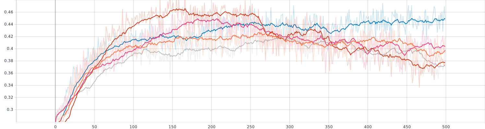
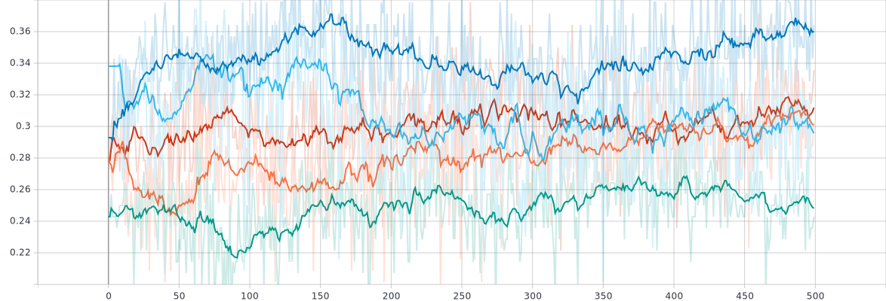
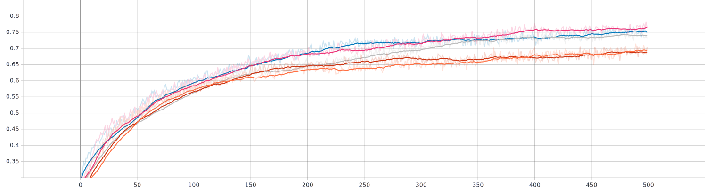
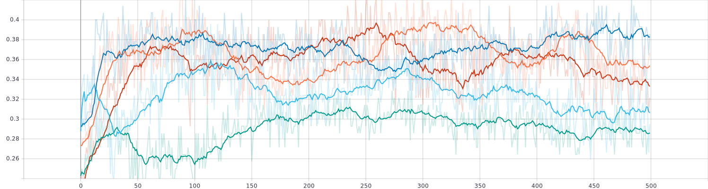
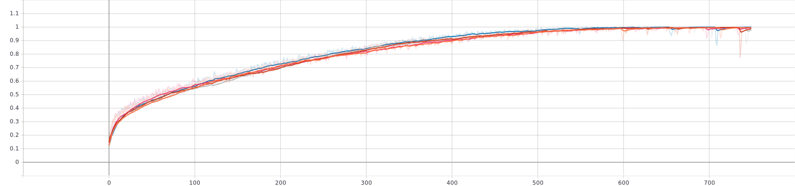
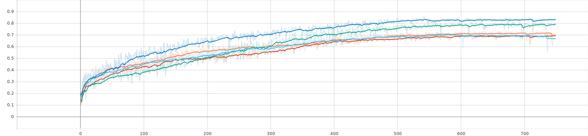
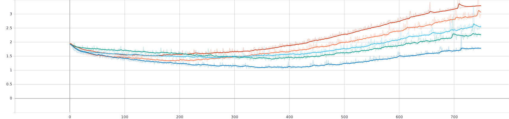

```{r Setup, include=FALSE}
knitr::opts_chunk$set(echo = FALSE)
#knitr::opts_chunk$set(fig.width = 10, fig.height = 5)

library(ggplot2)
library(plotly)
library(tidyverse)
library(reshape2)
library(factoextra)
library(cluster)
library(spotifyr)
library(grid)
library(gridExtra)
library(compmus)
library(caret)
library(keras)
#library(formattable)
library(ramify)
library(e1071)
library(kableExtra)


load("spotify_env_vars.RData")
load("data/all_songs.RData")
SetEnvVars()

scale_01 <- function(x){(x-min(x))/(max(x)-min(x))}
#save(all_songs, file='data/all_songs.RData')
```


Introduction
===

Column
---

### The Idea
In this portfolio I am going to perform research in the genre of hardstyle music.
A lot of people would say that the music within this genre is all alike. However there is a common assumption that each artist distinguishes him- (or her)self with his (or her) unique style and sound. This is most noticable in the tones used in the so called _drop_ and as bass-kick.

I'm going to research whether this assumption can be proved with a (computer)model. In particular a classification model that can classify a song with an artist (assumed that this song is of one of the artists used for training the model). Because if such model can be used we can assume that indeed there is something in the songs that are unique for each artist.
However if such model is not possible, I'm going to research why this is the case, or what is necessary to create such model.

N.B.

* It may be possible, due to the amount of tabs I have in my portfolio or the window you view my portfolio in being small, that the tab bar becomes multiline. In this case flexdashboard hides the top lines of each storyboard, which in some cases only hides part of the story headers, but sometimes can also hide important parts like, for example, the conclusion. In this case I would suggest you find a way to increase the width of the window you view this portfolio in.
* Furthermore, I have tried to make everything as clear as possible in what I have done without echoing each code chunk. Since I have saved most of the data as .RData file, echoing the code doesn't even make sense. However I have saved all code in another markdown file which can be found [here](https://github.com/Saltpile123/CM_Portfolio/blob/master/data/under_the_hood.Rmd), may you be interesting in looking under the hood of this portfolio.

Column
---

### The Corpus
To do this research we obviously need some data to work with.
For this I'm going to use the songs from the top 5 hardstyle artists together with the songs of my 2 most favorite artists.
Together this gives me a corpus of 698 songs where each artist has about 50 songs or more.
This should be enough data to build a decent classification model.

Artist             | Songs on Spotify
:-----------------:|:----------------:
[Noisecontrollers](https://open.spotify.com/artist/6qJ61DomA73g7jQEKESw9Z?si=7RNaKTn-TlyWurbRZeFgOw) | 198
[Headhunterz](https://open.spotify.com/artist/6C0KWmCdqrLU2LzzWBPbOy?si=UscMpSq8SCayJ7t5-h9dAg) | 146
[Brennan Heart](https://open.spotify.com/artist/5QySqc6yAFDx9m7fedFZmC?si=ARtnM0H8RlWjFCGiVRhcZw) | 99
[Showtek](https://open.spotify.com/artist/3gk0OYeLFWYupGFRHqLSR7?si=YLe5NIvlQhC3EspjWanh1A) | 88
[Da Tweekaz](https://open.spotify.com/artist/6UOk7DmvqlzWmo6gjhZvn6?si=pOFDdFMMS02va47WsVQuiA) | 61
[Sub Zero Project](https://open.spotify.com/artist/4f0OXMMSxr0r8Ztx6CdpAl?si=rZiB80v5TPyP_iNgfzIyHw) | 54
[D-Block & S-te-Fan](https://open.spotify.com/artist/6L7a6wPGpvLtTwOsMLnF1z?si=1duSNWSISZGrNoPgEWkFbw) | 46

The Data {.storyboard}
===

### __Data Understanding__<br/>In this section I do a quick exploration of the data. I look if there may be already some patterns. {data-commentary-width=550}
```{r Violinplots}
create_violin <- function(cat, catstr){
  plt <- ggplot(all_songs, aes(x=num, y=cat, fill=artist_name, col=artist_name)) +
    geom_violin() +
    labs(fill='Artist', color='Artist', title=paste('Violinplot of', catstr)) +
    ylab(catstr) +
    theme_minimal() +
    theme(axis.title.x=element_blank(),
          axis.text.x=element_blank(),
          axis.ticks.x=element_blank())
  if (catstr == 'Danceability'){plt <- plt + theme(legend.position = 'left')}
  else if (catstr == 'Tempo') {plt <- plt + theme(legend.position = 'right')}
  else {plt <- plt + theme(legend.position = 'none')}
  #print(plt)
  plt
}

create_violin(all_songs$danceability, 'Danceability')
create_violin(all_songs$energy, 'Energy')
ggplot(all_songs, aes(x=key, fill=artist_name)) + geom_histogram(bins=12) + 
  labs(fill='Artist', title='Histograms of Key') +
  xlab('Key') +
  ylab('Count') +
  facet_grid(~ artist_name) + 
  theme(strip.text=element_text()) +
  theme_minimal() +
  theme(legend.position='none')
create_violin(all_songs$loudness, 'Loudness')
ggplot(all_songs, aes(x=mode, fill=artist_name)) + geom_histogram(bins=2) + 
  labs(fill='Artist', title='Histogram of Mode') +
  xlab('Mode') +
  ylab('Count') +
  facet_grid( ~ artist_name) +
  scale_x_continuous(breaks=c(0,1)) +
  theme(strip.text=element_text()) +
  theme_minimal() +
  theme(legend.position='none')
create_violin(all_songs$speechiness, 'Speechiness')
create_violin(all_songs$acousticness, 'Acousticness')
create_violin(all_songs$instrumentalness, 'Instrumentalness')
create_violin(all_songs$liveness, 'Liveness')
create_violin(all_songs$valence, 'Valence')
create_violin(all_songs$tempo, 'Tempo')
#ggplot(all_songs, aes(x=num, y=tempo)) +
#  geom_point() +
#  labs(color='Artist', title='Scatterplot of Tempo') +
#  ylab('Tempo') +
#  theme_minimal() +
#  theme(axis.title.x=element_blank(),
#        axis.text.x=element_blank(),
#        axis.ticks.x=element_blank())
```

***

#### Data Understanding
Before trying to build a classifier we first need to do some exploration on and understanding of the data.
In the first place we need to decide which information we are going to use for the classifier.
For example the genre for each artist probably will be similar and thus will not be useful data.
Furthermore we have two possible sets of features we can use to train the classifier with:

* _Track Features_, these features are returned by the `get_track_audio_features()` method of the `spotifyr` package. This method is also used to get the track features in the `get_artist_audio_features()` and `get_album_audio_features()` methods.
  These features are values that say something about the song in a whole, thus we will get 1 feature value per song.
* _Track Analyis_, these features are obtained using the `get_track_audio_analysis()` method fromt the `spotifyr` package.
The analysis features are quite a bit more extensive than the track features, thus will probably contain a lot more information about the song. However this means more data, which will take up more disk space, take longer to obtain from Spotify, make the classifiation training take more time and make the model quite a bit more complex (since we now need to add a time dimension to our model).

Because of the reasons described above I'm first going to focus on creating a model created with the _track features_. 
If I fail to create a good model with these features I'm going to take a look at the _track analysis_ features.

The track features include many features including the following numeric features that may be useful:

* Danceability
* Energy
* Key
* Loudness
* Mode
* Speechiness
* Accousticness
* Instrumentalness
* Liveness
* Valence
* Tempo

This is a lot of data in which some features may be very similar for all songs. It is useless to include this data in the trainingsdata for the classifier since it wouldn't provide good information to distinguish two songs from each other, let alone different artists.

To give a good insight in these features and get a quick overview of which of these may be show some clear differences between the artists, I have combined all songs from all artists into one dataset. I have plotted each of them here (I would have made them interactive however due to limitations of the _plotly_ package they are just images. From these plots you can observe that the _Mode_ feature is not useful. Some other features don't seem to show any clear patterns on their own too. That is why I have plotted each feature relative to the other features. If one of these plots already show clusters we probably only need to use these two features to train a classifier with. However I have put these plots in a separate [document](https://github.com/Saltpile123/CM_Portfolio/blob/master/plots/All_features_relative.md) because of the amount (121) and because no plot seems to show any clear clusters.

So although the violinplots did seem to show some nice patterns, these patterns seem to be very similar among the artists.
This thus means we need to perform Principal Component Analysis.
I will elaborate more on this in the Data Preparation section. If the PCA provides us with good clusters we know that we can quite easily build a classifier, however if the PCA doesn't provide us with any noticable clusters it may be possible that the data still can be clustered, but in higher dimensions. This, however, is quite hard to visualize, thus then I will probably just feed the data to the classifier and hopefully it will be able to draw relations between the features and the artist.


### __Data Preparation__ (Dimensionality Reduction)<br/>Not all data is useful for a classifier, therefore we need to reduce the dimensionality of our dataset. {data-commentary-width=750}
```{r PCA & Clusters, fig.width=10, fig.align='center'}
scaled_track_features <- apply(all_songs[,1:11], 2, scale_01)
all_songs_pca <- prcomp(scaled_track_features)

pam_feat <- pam(scaled_track_features, 7)
pam_pca <- pam(all_songs_pca$x, 7)

plt_pca <- ggplot(all_songs, aes(all_songs_pca$x[,1], all_songs_pca$x[,2], col=as.factor(all_songs$artist_name))) + 
  scale_shape_manual(values=c(seq(1,6), 8)) +
  geom_point() +
  labs(color='Artist', title='Figure 1: PC2 plotted against PC1') +
  xlab('Frist Principal Component') +
  ylab('Second Principal Component')
plt_pca

feat_plt <- fviz_cluster(pam_feat, data=scaled_track_features, geom='point', main='Figure 2: K-Means on Track Features')
pca_plt <- fviz_cluster(pam_pca, data=all_songs_pca$x, geom='point', main='Figure 3: K-Means on Principal Components')
grid.arrange(feat_plt, pca_plt, nrow=1)
```

***

#### Dimensionality Reduction
Before we can feed the data to the classifier we first need to prepare the data. One part of data preparation is data reduction. This means that we reduce the initial dataset to be only data we are going to use for the classifier.
Since we are going to use the track features we can all discard all data other than these features. I combined this data only into a new data frame and saved that as my new corpus. 
Previously I mentioned removing the _Mode_ feature from our data as well, however since we are now going to perform PCA I will keep this feature for now.
Of course we still need to include the _Artist_ in our reduced dataset since we need to use that data as classes for the model.

#### Principal Component Analysis
As mentioned in the Data Understanding we need to apply Principal Component Analysis on the data since the features on their own or relative to one other feature didn't show any good clusters. Principal component analysis means that we reduce the data to a new dataset where each column is an information rich column that captures as much possible variation from the initial data.
This data may be even better to use than the features on their own since the PCA data will be more dense in information, and will contain only the relevant parts of the features.
Since the principal components will take the differences between values we need to make sure to scale the data first. This is because for example the tempo will otherwise be the leading variable in the principal components because due to its big values (relative to the other features) it also encapsulates the most variance.
After the scaling I made a PCA of the data, I have plotted the first two against each other (see _Figure 1_).

As you can see, the data is now seperated into two columns over the first two principal components.
Although there are two columns and the data seems to be seperated this way, each artist looks to have around the same amount of songs per column, thus not being very helpful.  
It however may be the case that another separation can be found in other components, since we have 11 of them. To see wether this is the case, if have plotted the first 3 components with k-means clustering applied in the story _Further analysis on the Principal components_.

#### K-Means Clustering
We can use clustering for this and k-means clustering in particular. This clustering algorithm first assigns each data point to a random cluster. Then it iteratively calculates the centerpoint of each cluster and assigns each data point to the cluster with the nearest centerpoint, this is done using some distance formula that handles multidimensional data (like Euclidean distance, Manhattan distance).
To compare the standard features with the principal components I have applied k-means clustering on both the features data and principal components data with 7 clusters (we have 7 artists). 

If the data can be effectively clustered we would see 7 separate clusters, and in each cluster there will be only songs of one artist.  
However, as you can see in _Figure 2_ and _Figure 3_ (can be found interactive in the next two stories) most data points are all in one big cluster and the outlines of each cluster all cross each other. Even the principal components, which spread the data over two columns on the first two components has songs in each column in the same cluster. To further illustrate this I show below that cluster 1 contains songs of each artist.

We do see that the standard track features have some outliers in general, while the principal components only have small outliers in each column. It may however be possible that there is more spread in higher dimensions of the principal components, which I explored in the _Further analysis on the Principal Components_ section.

```{r Cluster 1}
#unique(all_songs[pam_pca$clustering==1,]$artist_name)
songs_in_cluster1 <- data.frame(unique(all_songs[pam_pca$clustering==1,]$artist_name))
colnames(songs_in_cluster1) <- c('Artist')
songs_in_cluster1$Occurences <- sapply(songs_in_cluster1$Artist, FUN=function(x){nrow(all_songs[pam_pca$clustering==1 & all_songs$artist_name==x,])})
songs_in_cluster1 %>% 
  kable() %>% 
  kable_styling(bootstrap_options = c('striped'))
```


### __Figure 2__ (interactive)
```{r}
plotly_build(feat_plt)
```


### __Figure 3__ (interactive)
```{r}
plotly_build(pca_plt)
```

### __Further analysis on the Principal Components__<br/>I further analyze the principal component via a 3d plot on the first 3 components.{data-commentary-width=750}
```{r 3D PCA Plot}
ply_pca <- plot_ly() %>% 
  add_trace(
    type="scatter3d",
    mode="markers",
    name=all_songs$artist_name,
    x=all_songs_pca$x[,1],
    y=all_songs_pca$x[,2],
    z=all_songs_pca$x[,3],
    #color=pam_pca[["clustering"]],
    color=as.factor(all_songs$artist_name),
    colors="Set1",
    text=paste('Artist:', all_songs$artist_name, '<br>Track:', all_songs$track_name, '</br>', '<br>Cluster:', pam_pca[["clustering"]], '</br>'),
    #text=as.factor(all_songs$track_name),
    hoverinfo='text',
    #hovertemplate=paste('Artist: %{color}', '<br>Track: %{text}</br>', '<br>Cluster: %{pam_pca[["clustering]]}</br>'),
    size=I(50),
    legendgroup='group1'
  ) %>% 
  add_trace(
    type="mesh3d",
    opacity=0.1,
    name=paste("Cluster", pam_pca[["clustering"]]),
    x=all_songs_pca$x[,1],
    y=all_songs_pca$x[,2],
    z=all_songs_pca$x[,3],
    color=as.factor(pam_pca[["clustering"]]),
    colors="Set1",
    hoverinfo='skip',
    showlegend=TRUE,
    legendgroup='group2'
    #text=pam_pca[["clustering"]]
    #hovertemplate='Cluster: %{text}'
  ) %>% 
  layout(
    title="Figure 4: Plot of first 3 principal components",
    scene = list(
      xaxis=list(
        title='PC1',
        spikecolor='red',
        spikethickness=1,
        spikesides=FALSE
      ),
      yaxis=list(
        title='PC2',
        spikecolor='green',
        spikethickness=1,
        spikesides=FALSE
      ),
      zaxis=list(
        title='PC3',
        spikecolor='blue',
        spikethickness=1,
        spikesides=FALSE
      )
    )
  )
ply_pca
```

***

#### Principal Components
The Principal Components are very abstract, it is therefore very hard to explain what part of the data contributed to any good or bad results when using the principal components for, for example, classification.

Principal components are designed to represent as much variation in the data as possible thus it will not represent each feature anymore; each component will probably represent a comination of them, with the first components probably being a combination of features with high variation.  
To give more insight in what kind of music is represented by each value of the first 3 principal components I have made a 3 dimensional plot in which I have plotted the songs colored by their artist on the first 3 components in the x, y and z axis respectively.  
In this plot I have included the clusters as well, but it can be noticed straight away that these clusters are all over the place, however the clusters seem to be the most separated on the third principal component (z-axis).  
To get a better view of the songs I therefore suggest you to disable the clusters by either clicking once on the cluster part of the legend or double clicking on the artist part of the legend.

After creating this plot I have used it to pick songs on the limits of each component to listen to and compare.
Using this comparison I gained insight in what type of song is represented by each principal component.

#### Principal Component 1

* Low values: Better flowing music, easier to listen to.
* High values: Very spiky aggresive music.

The first principal component seems to characterize the flow of a song. Higher values seem to correspond with very 'spiky' songs; hard bass and no real flow.  
I had expected that the _danceability_ feature would be very low for these songs, however a few samples did not show that either high or low values of the first principal component corresponded with any high or low values of _danceability_. 

#### Principal Component 2

* Low values: low Instrumentalness, high Speechiness
* High values: high Instrumentalness, low Speechiness

The second principal component was quite noticable straight away, songs with low values had lots of speech in them, songs with high values had no or barely noticable voice in them.  
To confirm my observation I have picked 4 songs per column; 2 with low values for the second principal component and 2 songs with high values for the second principal component. Below I made two simple tables in which you can clearly see the correspondence between the value of the second principal component and the speechiness and instrumentalness of the song.

```{r PC2 Analysis}
load('data/low_pc2_songs.RData')
load('data/high_pc2_songs.RData')
low_pc2_songs %>% 
  kable(caption='Songs with low values on the second Principal Component') %>% 
  kable_styling(bootstrap_options = c('striped', 'condensed'))
high_pc2_songs %>% 
  kable(caption='Songs with high values on the second Principal Component') %>% 
  kable_styling(bootstrap_options = c('striped', 'condensed'))
```

#### Principal Component 3
* Low values: Very melodic, lots of synth
* High values: Very heavy bass,

As for the third principal component, clear differences between songs were already harder to notice. One big difference could however be noticed; Songs with low values for the third principal component had way more synth and thus melodic feel to them than songs with higher values for the third principal component. Some songs with high values for the third component didn't even have some kind of chorus (which contains in most hardstyle songs most of the synth of the song) and were just 2 to 3 minutes of bass kick with some distorted noise.


### __Adding more data__</br>I add more data to my corpus to create better models.
To further enrich my data I have added the audio analysis of each song to my corpus.  
Then I have used the methods provided to add the delta of the chroma features and delta of the timbre features to my data.

After testing I found that adding more data to the dataset gained better results (see [Modeling] -> _Changing the Approach and Model architecture_). Therefore I also extracted the delta of the delta timbre to use as well.


### __Data Preparation__ (Subsetting)<br/>Before we can train a classifier we need training- and testingdata. To reduce data loss I use cross validation.
#### Subsetting the data for the classifier
Since we are going to train a classifier we also need to seperate the data into two subsets:

* A trainingset, containing about 80% of the data. This data will be used to train the classifier.
* A testset, containing the remaining 20% of the data. This data will be used to test the classifier.

However, since taking only 20% of the data as validation data, this means we get only 140 songs to validate the classifier. In the best scenario this will mean 20 songs per artist, however since we don't have an equal amount of songs per artist we will most likely not get 20 songs per artist in the validation data.

#### K-Fold Cross Validation
For this reason I'm going to perform k-fold cross validation on the data with 5 folds. This means that I'm going to shuffle the data and then divide the data into 5 parts (thus each part is 20% of the data). After that I will repeatedly take one part as testset and the other parts as trainingset.
This way all data will be once testdata and 4 times trainingsdata, resulting in a model that has seen more data and thus is less overfitted on that data, giving a better estimate of the real performance of the model.

To do this I first shuffle the indices of the data.
Then I create a vector with equal amount of items per fold. Lastly I assign to each index a fold.

```{r K-Fold CV, echo=TRUE}
set.seed(123)   # Set a seed to make reproducible results
k <- 5          # Amount of folds
shuffled_indices <- sample(1:nrow(all_songs))                          # Shuffle the indices
fold_breaks <- cut(1:length(shuffled_indices), breaks=k, labels=FALSE)  # Split the data into k equal parts
fold_indices <- fold_breaks[shuffled_indices]                           # Assign a fold to each index
```

#### Preparing the _Track Features_ Data
The first data I am going to use to train a classifier are the _track features_.
What data is included in this can be found in [The Data]. 

To make sure each feature has the same impact on the model each feature must be scaled to be within the same limits. I choose to scale the data between 0 and 1.

```{r Preparing Data, echo=TRUE}
scale_01 <- function(x){(x-min(x))/(max(x)-min(x))}   # Define scale function
train_features <- apply(all_songs[,1:11], 2, scale_01)     # Scale track features data
```

Then I converted the artist names to a factor vector for the support vector machine and I created a one-hot-encoding matrix of the artist names for the Keras model.
A one-hot-encoding matrix is just a row of zeros with one 1 at the position of the true class.
Thus the one-hot-encoding vector for a song made by Noisecontrollers will contain only zeros and 1 one at the position of Noisecontrollers in the one-hot-encoding matrix like this:

```{r Label Preparation}
train_factors <- as.factor(all_songs$artist_name)     # Create factor vector for class labels
train_targets <- to_categorical(as.integer(as.factor(all_songs$artist_name)))   # Create one-hot-encoding matrix for class labels
train_targets <- train_targets[,2:8]                  # Get only the relevant columns
print(train_targets[1,])
```


#### Preparing the _Principal Components_ Data

```{r Prepare PCA Data}
train_pca <- all_songs_pca$x
```

Preparing the Pincipal Components is very easy since one of the return values of the _prcomp_ function returns a matrix with for each component for each song a value. We can then just use this matrix as input features for the Support Vector Machine and Keras Deep Learning Model.  
Since the labels did not change (each song is still produced by its original artist) we can reuse this data; the one-hot-encoding matrix as target data for the Keras model and the factorised labels as target data for the SVM.  
We also don't need to scale the data since the data was already scaled before it was put into the principal component analysis, and the analysis itself scales the data too.


#### Preparing the _Delta Chroma, _Delta Timbre_ and _Delta Delta Timbre_ Data

```{r Load Delta Data}
load('data/all_songs_delta_timbre.RData')
load('data/all_songs_delta_delta_timbre.RData')
```
```{r Create Delta Timbre Training Data, echo=TRUE}
train_timbre <- apply(all_songs_delta_timbre[,5:28], 2, scale_01)
```

In order to prepare the delta data I only needed to take the relevant data columns of the initial dataset with all audio analysis and rescale the data to be within the [0,1] range, since some deltas are negative.


Modeling {.storyboard}
===

### __Introduction__<br/>I introduce you to the model types I am going to use.
#### Introduction
As mentioned before I'm going to train multiple models, trained on different subsets of the initial dataset:

* A model trained on all features mentioned in [The Data] (Data Understanding).
* A model trained on (a subset of) the Principal Components.
* A model trained on deltas of timbre and chroma and delta of timbre deltas.

Multiclass classification models can be made in different ways.
Because I am very intrigued by deep learning, I had the intention from the start to make a deep learning model to use for classification.
Deep learning comes in many packages but I already had heard of TensorFlow and especially its embedding in the [Keras library](https://keras.io/).
Keras originally is a deep learning library for the Python programming language, however I had seen a c# version as well.
When doing Datacamp courses I noticed a course called _Introduction to TensorFlow in R_ which included lessons for Keras in R.
So I looked into the Keras package for R and found that it works the same as Keras for Python except for some methods having other names.

Multiclass classification models can, however, be made a lot easier than creating a whole Keras model, namely with [Support Vector Machines](https://en.wikipedia.org/wiki/Support-vector_machine).
Especially since R provides very easy tools to create one.

That is why I decided to not only create a Keras model but also a Support Vector Machine as comparison model to see whether deep learning is better practice for this kind of classification, or if it is way easier (with maybe better results) to just create a support vector machine model.

### __Introduction to the Support Vector Machine__<br/>I explain how I create and run the Support Vector Machine Models.
```{r RUN_SVM Declaration, echo=TRUE}
run_svm <- function(k, x, y, ind){
  # Process each fold
  svm_accuracies <- c()
  for (i in 1:k){
    cat("__Fold #", i, ":__  ")
    
    # Get all data rows of this fold
    inds <- which(ind == i, arr.ind=TRUE)
    
    # Take these data rows as validation data
    val_x <- x[inds,]
    val_y <- y[inds]
    
    # Take the other data rows as training data
    train_x <- x[-inds,]
    train_y <- y[-inds]
    
    # Create a support vector machine model and assess its performance
    svm_model <- svm(x=train_x, y=train_y)
    predicted <- predict(svm_model, val_x)
    confusion <- confusionMatrix(predicted, val_y)
    acc <- confusion$overall["Accuracy"]
    svm_accuracies <- c(svm_accuracies, acc)
    print(acc)
    
    cf <- knitr::kable(table(predicted, val_y)) %>% 
      kable_styling("striped", full_width = T)
    print(add_header_above(cf, c("Predicted", "Actual"=7)))
    cat("\n  ...  \n")
    cat("\n  ")
  }
  cat("__Mean accuracy:__ ", mean(svm_accuracies))
}
```

***

To make the creation and execution of a Support Vector Machine model easier, I have made a function that I can call with different training and validation sets.  
As can be seen this function has multiple arguments:

* _k_: The amount of folds.
* _x_: The training data.
* _y_: The validation data.
* _ind_: A vector that assigns each data-row to a fold.

Since creating a SVM is very easy, I only need to extract the relevant data for each fold and create a svm-model on the training data of that fold.  
I can then use the validation data of the fold to create a confusion matrix of the model that will tell me which label was predicted most for each true label, getting more information than when I would only use the accuracy of the model.


### __Introduction to the Keras Model__<br/>I explain the architecture of deep learning model I used and how I used it.
Before you can pass data into a deep learning model, you first need to create one.  
To do this I have defined a function that creates a sequential deep learning model. Sequential means that the each output has its own input and that the output is never used as input (as is the case in recurrent networks).  
Each layer is a dense layer which means that each node of each layer is connected to each node in the previous and next layer.

#### The Build Model Function
Since the original track features data has 11 columns we need to have 11 inputs in our network, however since I have multiple data sets I want to use, I made the input size variable.  
Then I created two hidden layers with 25 and 15 nodes respectively. Each node uses _relu_ as its activation function since this is the most basic activation function. 

```{r}
knitr::include_graphics('plots/relu.png')
```

The _relu_ activation function outputs, as can be seen in the picture, zero for all negative input and is linear for all positive input. _Relu_ is generally seen as the go to activation function for simple neural networks. I may try different activation functions is the future.

The output layer consists of 7 nodes since we have 7 classes.  
I have used the _softmax_ activation for this output layer since we want for each class a probability. The _softmax_ activation function makes sure this is the case by converting the outputs to all sum to one.

```{r Build_Model Function, echo=TRUE}
build_model <- function(input_size) {
  model <- keras_model_sequential() %>%
    layer_dense(units=25, activation='relu', input_shape = input_size) %>% # Fully connected input layer with 25 nodes
    layer_dense(units=15, activation='relu') %>%  # Second fully connected hidden layer with 15 nodes
    layer_dense(units=7, activation='softmax')    # Output layer with 7 nodes (7 classes)
  
  model %>% compile(
    optimizer = 'rmsprop',
    loss = 'categorical_crossentropy',
    metrics = c('accuracy')
  )
}
```

Then I created a similar function to the _run_svm_ function described earlier to run the model in a k-fold corss validation manner on the provided data.  
I have actually created two functions for this since I am using [Tensorboard](https://www.tensorflow.org/tensorboard) to better inspect the performance of the deep learning models.  
However Tensorboard is designed to visualize the results of the model in real time and is therefore hosted on the localhost and can thus sadly not be included in this dashboard.  
Instead I have downloaded the graphs of the accuracy on the training and validation data and show these instead with 0.9 smoothing applied to show a better trend of the accuracy over the epochs.  
The arguments of these functions are very much self-explanatory and I will thus not go further in on this.

```{r RUN_KERAS Declaration, echo=TRUE}
run_keras <- function(k, x, y, ind, num_epochs, b_size, FUN = build_model){
  all_scores <- c()
  
  for (i in 1:k) {
    cat("Processing fold #", i, "\n")
    
    # Prepare the validation data: data from partition #i
    inds <- which(ind == i, arr.ind = TRUE) 
    
    # Get the training and validation data
    val_x <- x[inds,]
    val_y <- y[inds,]
    train_x <- x[-inds,]
    train_y <- y[-inds,]
    
    # Build the Keras model
    model <- FUN(ncol(train_x))
    model %>% fit(train_x, train_y,
                  epochs=num_epochs, batch_size=b_size, verbose=0)
    
    # Evaluate the model on the validation data
    results <- model %>% evaluate(val_x, val_y, verbose = 0)
    print(paste("Loss:", results$loss, "Accuracy:", results$accuracy))
    all_scores <- c(all_scores, results$accuracy)
  }
  
  print(mean(all_scores))
}
```

```{r RUN_KERAS_TENSORBOARD Declaration, echo=TRUE}
run_keras_tensorboard <- function(k, x, y, ind, num_epochs, b_size, tensorboard_path, FUN = build_model){
  accuracy_histories <- c()
  
  for (i in 1:k) {
    cat("Processing fold #", i, "\n")
    
    # Prepare the validation data: data from partition #i
    inds <- which(ind == i, arr.ind = TRUE) 
    
    # Get the training and validation data
    val_x <- x[inds,]
    val_y <- y[inds,]
    train_x <- x[-inds,]
    train_y <- y[-inds,]
    
    # Build the Keras model
    model <- FUN(ncol(train_x))
    
    # Train the model (in silent mode, verbose=0)
    history <- model %>% fit(train_x, train_y,
                  epochs = num_epochs, batch_size = b_size, verbose = 0,
                  callbacks = callback_tensorboard(paste(tensorboard_path, "/run_", i, sep="")),
                  validation_data = list(val_x, val_y))
    
    accuracy_histories <- rbind(accuracy_histories, history$metrics$val_accuracy)
  } 
  
  # Run Tensorboard and create average accuracy dataframe
  tensorboard(tensorboard_path)
  average_accuracy_history <- data.frame(
    epoch=seq(1:ncol(accuracy_histories)),
    validation_accuracy=apply(accuracy_histories, 2, mean)
  )
  return(average_accuracy_history)
}
```


### __SVM on Track Features__<br/>I create a SVM model on the Track Features data and assess its performance. {data-commentary-width=500}
```{r SVM Classifier (K-Fold CV) on Track Features, results='asis'}
run_svm(5, train_features, train_factors, fold_indices)
```

***

#### Results of a SVM on the Track Features Data
To assess the performance of each model I have created a confusion matrix of the results. I have put the accuracy above each confusion matrix. Each row gives the predicted label while each column stands for the actual label. This way we can see which artists were correctly classified most times and if an artist is classified incorrectly which other artist was choosen instead.
If a model has very high accuracy we would see only zeros with on diagonal line of numbers going from top left to bottom right.

If we look at the accuracies we see that each model roughly has the same accuracy, small differences between the accuracies are probably explained by each fold having a different distribution of songs per artist. The mean accuracy of all models is 36%, which is, considering the type of data, not that bad.

When looking at the confusion matrices we see that most of the inaccuracy of the models are explained by all of them classifying most songs as being from _Noisecontrollers_. Considering this artist having most songs in my corpus begs me to question whether this model actually 'learned' patterns in the data or just found out that guessing _Noisecontrollers_ most times was just the right answer. Especially if we look deeper into the confusion matrices we see that the second most predicted label is _Headhunterz_ who have, after _Noisecontrollers_, the most songs in my corpus.


### __Keras model on Track Features__<br/>Here I make a Keras deep learning model on the Track Features data.{data-commentary-width=600}
```{r Keras Model (K-Fold CV) with Tensorboard on Track Features, eval=FALSE}
run_keras_tensorboard(5, train_features, train_targets, fold_indices, 500, 1, "logs_features", FUN=build_model)
```
```{r Keras Model (K-Fold CV) on Track Features, eval=FALSE}
run_keras(5, train_features, train_targets, fold_indices, 160, 1, FUN=build_model)
```

__Accuracy of the training data on each fold for 500 epochs with 0.9 smoothing__



__Accuracy of the validation data on each fold for 500 epochs with 0.9 smoothing__


***

#### Results of a Keras Model on the Track Features Data
Again I used K-fold cross validation to train 5 different models on 4 parts of the data as training data and the other part as validation data.  
During the training I kept track of the accuracies and loss values of the model on the training and validation data on each epoch. Because I kept track of these values I used more epochs than were probably needed to see what the best epoch amount would be.  

As we can see the accuracy of the models on the trainingdata reached a peak around 160 epoch with a mean accuracy around 43%.  
When looking at the accuracy of the models on the validation data some kind of peak can be distinguished here as well, hopefully indicating that the peak in the accuracies on the trainingsdata did not mean that the models were overfitted in the trainingdata. We do see however that the accuracies of the models on the validation data don't show much of a trend and vary much more between the models than the training accuracies do.  
I also wanted to create a confusion matrix of the outputs of the deep learning models, however due to the classes be converted to a one-hot-encoding matrix 
As a final test I once again trained the models on the data with 160 epochs and got a final accuracy around 30%.

Considering the time it took to train these models on 160 epochs (around 2 minutes) and lower accuracies I conclude that using a deep learning model on the _track features_ data is not feasible.  
It may be argued that using a SVM isn't feasible too since the accuracy is still very low and you can see that the SVM just predicts the most common labels, to which common label is most probable for a certain song.


### __SVM on Principal Components__<br/>I create a SVM model on the Principal Components data and assess its performance. {data-commentary-width=500}
```{r SVM Classifier (K-Fold CV) on PCA, results='asis'}
run_svm(5, train_pca, train_factors, fold_indices)
```

***

#### Results of a SVM on the Principal Components Data
I again have applied the same technique as for the track features data, however this time I have used the principal components data as training data.  
Sadly to no avail, the accuracy is about the same, and again we see that the most common artists are preferred way over the other artists.  
If the Keras model again provides the same results, something is probably going wrong somewhere and thus needs to be fixed.


### __Keras model on Principal Components__<br/>Here I make a Keras deep learning model on the Principal Components data.{data-commentary-width=600}
```{r Keras Model (K-Fold CV) with Tensorboard on Principal Components, eval=FALSE}
run_keras_tensorboard(5, train_pca, train_targets, fold_indices, 500, 1, "logs_pca", FUN=build_model)
```
```{r Keras Model (K-Fold CV) on Principal Components, eval=FALSE}
run_keras(5, train_pca, train_targets, fold_indices, 200, 1, FUN=build_model)
```

__Accuracy of the training data on each fold for 500 epochs with 0.9 smoothing__



__Accuracy of the validation data on each fold for 500 epochs with 0.9 smoothing__


***

#### Results of a Keras model on the Principal Components Data
Here too I have applied the same steps I performed when applying deep learning on the track features data.  
And again too we see about the same results, which I was afraid of; The model got quite good results on the training data, however the validation accuracy is very bad. Each fold produces very dissimilar results albeit in roughly the same (very low) accuracy range.

What can be noticed is that the accuracy of the training data does not fluctuate as much as it did in the track features models. What is causing this is unclear to me, since I have used the same architecture, activation functions and optimizer for the models.

What is clear however is that something needs to change, since the data and architectures used now are not sufficient for creating good performing models.


### __Changing the Approach and Model architecture__<br/>Since the current models are performing badly, I change a few thing.{data-commentary-width=750}

```{r Load All Oversampled Data sets}
load('data/oversampled/oversampled_all_songs.RData')

load('data/oversampled/oversampled_factors.RData')
load('data/oversampled/oversampled_targets.RData')

load('data/oversampled/oversampled_features.RData')
load('data/oversampled/oversampled_delta_timbre.RData')
load('data/oversampled/oversampled_delta_delta_timbre.RData')

load('data/oversampled/oversampled_full_data.RData')
```

```{r Pie Charts}
all_songs_table <- data.frame(table(all_songs$artist_name))
colnames(all_songs_table) <- c('Artist', 'Amount of Songs') 

oversampled_table <- data.frame(table(oversampled_all_songs$artist_name))
colnames(oversampled_table) <- c('Artist', 'Amount of Songs')

plot_ly() %>% 
  add_pie(all_songs_table, 
          title='Contribution of each artist to the original corpus',
          name='All Songs',
          labels=all_songs_table$Artist, 
          values=all_songs_table$`Amount of Songs`,
          domain = list(row = 0, column = 0),
          textinfo='percent', #textinfo='label+percent',
          hovertemplate=paste('Artist: %{label}', 
                              '<br>Amount of Tracks: %{value}</br>', 
                              'Percentage: %{percent}', 
                              '<extra></extra>')
          ) %>% 
  add_pie(oversampled_table,
          title='Contribution of each artist to the sampled corpus',
          name='Oversampled Songs',
          labels=oversampled_table$Artist,
          values=oversampled_table$`Amount of Songs`,
          domain = list(row = 1, column = 0),
          textinfo='percent', #textinfo='label+percent',
          hovertemplate=paste('Artist: %{label}', 
                              '<br>Amount of Tracks: %{value}</br>', 
                              'Percentage: %{percent}', 
                              '<extra></extra>')          
          ) %>% 
  layout(#title = 'Contribution of each artist to the corpus',
         xaxis = list(showgrid = FALSE, zeroline = FALSE, showticklabels = FALSE),
         yaxis = list(showgrid = FALSE, zeroline = FALSE, showticklabels = FALSE),
         #showlegend=F,
         grid=list(rows=2, columns=1))
```

***

#### Some insights
When doing some additional testing I found that adding more data gained better results. E.g. when using only the delta timbre and chroma I already gained better results than just the track features. When combining the delta timbre and chroma with the track features accuracy increased even further.  
Because I had also extracted the delta of the delta timbre I have added this data my final data set as well.

The final dataset of all combined features now contained 47 columns:

* All Track Features
* Chroma Deltas
* Timbre Deltas (c1 ... c12)
* Delta Timbre Deltas (d1 ... d12)

The name of each datacolumn of the final corpus can be seen below.

```{r Print Colnames(Oversampled_full_data)}
colnames(oversampled_full_data)
```

#### Changing the model architecture
Since the data now contains more columns, the _build_model_ function as described earlier did not work as well anymore. Although the input size was a variable passed as argument, the architecture of the network was based on the original dataset size: 11 columns. Since the data now contains 47 columns, the first layers (with fewer nodes) could be bottlenecking the performance of the model.

Therefore I have slightly adjusted the original _build_model_ function to create _build_model2_. As can be seen not only did the size of the hidden layers increase, their activation is also changed. I did this after some feedback that suggested that an activation function which often just outputs 0 might not yield optimal results. A few quick tests further confirmed this.  
I also tried the _adam_ optimizer, which further increased the accuracy, so I sticked with that too.

````{r Build_Model2 Function, echo=TRUE}
build_model2 <- function(input_size) {
  model <- keras_model_sequential() %>%
    layer_dense(units=50, activation='elu', input_shape = input_size) %>% # Fully connected input layer with 50 nodes
    layer_dense(units=50, activation='elu') %>%  # Second fully connected hidden layer with 50 nodes
    layer_dense(units=7, activation='softmax')   # Output layer with 7 nodes (7 classes)
  
  model %>% compile(
    optimizer = 'adam',
    loss = 'categorical_crossentropy',
    metrics = c('accuracy')
  )
}
```

#### Sampling the data
As mentioned before I noticed that previous models just guessed the most common label when in doubt. This pattern was found in both the SVM and Keras model on both the track features as well as the principal components data.  
I therefore decided to give each artist equal amount of songs in the corpus.

The amount of songs for each artist and its contribution to the total corpus can be seen in the first pie chart. We indeed see that both _Noisecontrollers_ and _Headhunterz_ are overrepresented in the corpus.  

The minimum of songs for one artist was 46 (for _D-Block & S-te-Fan_), however subsampling all other artists to have only 45 songs in the corpus did not yield me very good results.  
Instead I have used the mean amount of songs of each artist in the corpus, which is around 100. I therefore have subsampled all artists which have more than 100 songs in the corpus and oversampled all artists which have less than 100 songs in the corpus.  
As can be seen in the bottom pie chart, each artist now has an equal amount of songs in the corpus.

Since the amount of songs has now changed I had to re-assign each song to a fold, which I have done below.  
The _oversampled_all_songs_ dataset contains all features of the over- and subsampled songs, as described above.

```{r Create Folds for Oversampled Data, echo=TRUE}
set.seed(123)
k <- 5
oversampled_shuffled <- sample(1:nrow(oversampled_all_songs))                      # Shuffle the indices
oversampled_breaks <- cut(1:length(oversampled_shuffled), breaks=k, labels=FALSE)  # Split the data into k equal parts
oversampled_indices <- oversampled_breaks[oversampled_shuffled]                    # Assign a fold to each index
```


### __SVM on All Features__<br/>I create new Support Vector Machine models on the combined features dataset.{data-commentary-width=500}
```{r SVM Classifier (K-Fold CV) on All Features, results='asis'}
run_svm(5, oversampled_full_data, oversampled_factors, oversampled_indices)
```

***

#### Finally Good Results
As can be seen from the accuracies per fold and the mean accuracy over all folds, I was finally able to create a models that performed reasonably accurate.  
Especially the confusion matrices now follow the pattern you would like to see in a confusion matrix; A diagonal line of high numbers going from top left to bottom right.

When evaluating these confusion matrices we see that in each fold about 1 or 2 artists where quite hard to classify, despite each artist being represented quite even in each fold. Interestingly, each fold different artists where badly classified, with _Showtek_ being the artist with which the SVM models had most often hard times.  
Due to each fold having 2 artists that were quite hard to indentify the overall accuracy of each fold quickly decreases, explaining the mean accuracy of 63%.

I am still very much pleased by the amount of increase in accuracy, especially since this accuracy isn't explained by probabilities anymore.


### __Keras Model on All Features__<br/>With the good results of the SVM on the combined features, lets see how the Keras model performs.{data-commentary-width=600}
```{r Keras Model (K-Fold CV) with Tensorboard on All Features, eval=FALSE}
avg <- run_keras_tensorboard(5, oversampled_full_data, oversampled_targets, oversampled_indices, 750, 15, "logs_all_features2", FUN=build_model2)
head(sort(avg$validation_accuracy, T))
```

__Accuracy of the training data on each fold for 750 epochs with 0.9 smoothing__



__Accuracy of the validation data on each fold for 750 epochs with 0.9 smoothing__


__Loss of the validation data on each fold for 750 epochs with 0.9 smoothing__


***

#### Even better results
With a mean validation accuracy steadily above 70% after 500 epochs, I think I can claim that I have created a deep learning model that was finally able to outperform the support vector machine model equivalent trained on the same data.  

It, however, took quite some testing and adjustments of especially the batch size, to get these results.  
The batch size determines how many samples are passed through the network before it is updated. Lower batch size values mean more updates, which often means that the accuracy of the network increases more per epoch. The downside is that each epoch takes more time -updating a neural network uses [gradient descent](https://en.wikipedia.org/wiki/Gradient_descent) which takes a lot of time, even with optimizers- and causes the accuracy of the network to spike more. Higher batch size values result in less updates per epoch and thus less time spend per epoch, but causing less increase in accuracy. You therefore need to perform more epochs.
A batch size value of 15 turned out to be quite good for me. As can be seen in the graphs I performed 750 epochs to see a good trend in accuracy. Due to have a batch size value of 15 we can also see that the graph behind the smoothed graph is alot smoother than the accuracy graphs of previous Keras models.

What is interesting and both worrying is that the accuracy of the model on the training data after 600 epochs reaches 100%. This means that the model is overfitted on the training data (thus is very good in only classifying only that part of the data). Overfitting most often results in the validation accuracy dropping from some point and the validation loss increasing heavily.  
This first characteristic does not seem to occur, since the accuracy of the models on the validation accuracy keeps increasing, even after 600 epochs. We do however see that the validation loss even surpasses the starting loss after around 450 epochs. So despite the validation accuracy increase even after 600 epochs I have decided to take 300 epochs as number of epochs for the final model.


Exploration of Novel Data {.storyboard}
===

```{r Load Align Frames, include=FALSE}
load('data/lake_of_fire.RData')
load('data/fallen_souls.RData')
load('data/knockout.RData')
load('data/darkest_hour.RData')
```

### __Novel Data__<br/>I gather the songs that are released after I made my initial corpus, to use as novel test data. {data-commentary-width=750}

#### Novel Data
As mentioned earlier, I want to test my models and techniques on novel data; songs that have been released by one of the artists of my corpus after I made my initial corpus.
A few songs have been released already.
I have put some of them below:

Artist             | Track Name
:------------------:|:----------------:
D-Block & S-te-Fan | [Lake Of Fire](https://open.spotify.com/track/0ri3xd7X6jvJQTz9T6IE7l?si=orVc36F-Q-mjiiHyejSp9g)
D-Block & S-te-Fan | [Feel It!](https://open.spotify.com/track/01xdiGuSuIf5qZulm1uqkY?si=Papt4K18RSqLVy-3tXJnVg)
D-Block & S-te-Fan | [Fallen Souls](https://open.spotify.com/track/7dOk9Bck00Zv0eeq5m6GoN?si=bVXEr2b0RraA8akTgbVj-g)
Brennan Heart | [Born & Raised](https://open.spotify.com/track/1UFkRFGEDkTafQF55tiQvY?si=IPAmFsVvTDuKx-mGG7vjwQ)
Da Tweekaz | [Power Of Perception](https://open.spotify.com/track/3QFVJxsqDK6ThOX5CLSBOM?si=bc_UEpYJRdmUF6Eu9w7lzQ)
Da Tweekaz | [Knockout](https://open.spotify.com/track/5LSCfqeq1u1GxKogSQFEZn?si=l2ljGiQxRKK4lCmmviuxxw)
Da Tweekaz | [We Made It](https://open.spotify.com/track/6yhvInrBQThvos9CNDJV8H?si=61bAoSpYTViDr6nDZV00mg)


### __Song Similarity using Chroma Features__<br/> I compare some songs by comparing their chromagrams.
One way to maybe see to whether two songs belong to the same artist would be by using chromagrams. From the list of novel songs we see that both _D-Block & S-te-Fan_ and _Da Tweekaz_ have released the most songs in the past weeks. So I choose to use 2 songs from _D-Block & S-te-Fan_ and one song from _Da Tweekaz_:

* _Lake Of Fire_ as comparison song.
* _Fallen Souls_ as base-line song for _D-Block & S-te-Fan_.
* _Knockout_ as base-line song for _Da Tweekaz_.

Then I created a _Dynamic Time Warp_ plot between the comparison and one base-line song to look if we can see some similarities between both songs from _D-Block & S-te-Fan_ and big difference between de comparison song and the base-line song of _Da Tweekaz_.

The plots can be found below:

```{r Load Dynamic Time Warps, include=FALSE}
load('plots/lf_fs_ld.RData')
load('plots/lf_ko_ld.RData')
```
```{r Plot Dynamic Time Warps}
db_st_plt
dbst_dt_plt
```

In my opinion the DTW between the two _D-Block & S-te-Fan_ songs looks a lot more symmetrical, which would indicate that both songs both follow a similar pattern. This while in DTW between the _D-Block & S-te-Fan_ song and  the _Da Tweekaz_ song both songs are very destinguishable, which would indicate that they are very dissimilar from each other.

We now need to find a way to convert this dissimilarity into a way to link an artist with a song.
So I made cepstrograms and self-similarity matrices for these novel songs and compare these in the next two stories.


### __Cepstrograms of the songs__ {data-commentary-width=550}
```{r Load Cepstrograms, include=FALSE}
load('plots/lf_cept.RData')
load('plots/fs_cept.RData')
load('plots/ko_cept.RData')
```
```{r Plot Cepstrograms}
lf_cept
fs_cept
ko_cept
```

***

Although the cepstrograms look very nice, it does not give a direct clue that _Lake of Fire_ and _Fallen Souls_ are from the same artist.
The only thing that can be noticed is that both songs are less loud than _Knockout_.
Sadly we don't see any patterns that are both in _Lake of Fire_ and _Fallen Souls_ and not in _Knockout_.
There is however one interesting thing about both the cepstrogram and self-similarity matrices of the three songs, but I will explain that in the Self-Similarity Matrix section.


### __Self-Similarity Matrix of the songs__ {data-commentary-width=550}
```{r Load Self Similarity Matrices, include=FALSE}
load('plots/lf_ss.RData')
load('plots/fs_ss.RData')
load('plots/ko_ss.RData')
```
```{r Plot Self Similarity Matrices}
lf_ss
fs_ss
ko_ss
```

***

Looking at the Self-Similarity matrices we do see very different plots. This, however, is again not what I wanted to see, since I would've hoped for shared features between the first two matrices. This was ofcourse to be expected since both the cepstrograms and similarity matrices are made with the same data/features of the three songs.

Since the similarity matrix of _Fallen Souls_ looked so interesting because of it having only one yellow horizontal (and thus vertical) line.
When listening to all three songs if found out that the yellow parts in both the cepstrograms and similarity matrices of _Lake of Fire_ and _Knockout_ corresponded to a 'drop' or at least and increase in overall music intensity and especially an increase in intensity of the bass frequencies.

The interesting bit is that the yellow part in _Fallen Souls_ actually corresponds with the sound of a piano! This piano is supported with a high sound in the background at about the same height resulting in an high magnitude at c02. It is also worth noticing that after this bit there is an increase in magnitude at the c05 level. This is because after both high magnitude bits at c02 there is a part where a female voice sings:
"In a place afar from home, there is a haunted house along an empty road, and if you listen close you can hear the whispers of the fallen souls" before going to a lower singing height.
The dark blue squares correspond to the sound of only a synth sounding the main melody of the song, explaining the relative small magnitude.


### __The symmetry of Knockout__<br/>I dive on the interesting pattern found in the self similarity of Knockout.{data-commentary-width=550}
```{r Load Knockout, include=FALSE}
load('plots/ko_ss.RData')
load('plots/ko_cept.RData')
```
```{r Plot Knockout}
ko_ss
ko_cept

knitr::include_graphics('data/Knockout.JPG')
```

***

When my portfolio was shown in class Ashley mentioned seeing something unqiue in the self similarity matrix of _Knockout_.
To show this more clearly I changed the colors of the cepstrograms and self similarity matrices to a more contrastive colorscheme.

We are now able to destinguish not only the standard diagonal line going from bottom left to top right in the cepstrogram of _Knockout_, but also a more vague line going from top left to bottom right. 
This means that not only is there similarity if you would play this track in two instances at once (pretty obvious), but also if you would play one of the instances in reverse.

We see that this line does not start and end exactly in the corners, which can be explained by the song having an intro that is different from its outro, but still spans quite a lot of the song.
When listening to the song I heard very similar parts.
That is why plotted the cepstrogram of the song again. We see that the song is very symmetrical, you would be able to put a vertical line around 80 seconds to divide the cepstrogram in two very identical parts. As expected we see that the first 20 and last 30 seconds do differ from each other explaining the inverse similarity line being in the top left and bottom right corners.

Looking at the cepstrogram made me curious whether I would be able to see this symmetricity from the actual audio file or even find this point. So I downloaded the song and put it in Audacity (audio editing software). First I loaded the song in regular playback then I imported the song again and reversed it.
The result can be seen in the image below the cepstrogram.

We see that this song is indeed very repetitive in that it has the same pattern twice, with the first occurence of this pattern being slightly longer than the second occurence.
This pattern contains the following parts:

1 Some singing without much extras.
2 Repetition of this singing but now with added drums.
3 (Short) Buildup.
4 Drop.

Both occurences of the song contain the same lyrics and melodies thus meaning that this pattern can be repeated forever.
The possibility of inversing the song comes from parts 1 and 2 being exactly the same apart from some added drums, that just follow the rithm of this part and thus only increases the intesity of the beats.

When two drops then are aligned this song will sound kinda similar to another instance of this song played in reverse. Only the lyrics do sound kinda strange since the voice is reversed as well, resulting in an unpleasant experience to the ear and the reason I have not included a link to the combination of these instances.

Whether this pattern of a song is common use for _Da Tweekaz_ needs to be seen, but at least this is an interesting feature that might be useful for later research.


### __Darkest Hour of the Clock__<br/>I further analyse interesting patterens from previous week and bring out another song for this.{data-commentary-width=550}
```{r Loading Darkest Hour, include=FALSE}
load('plots/lf_cept.RData')
load('plots/dh_cept.RData')
load('plots/dh_ss.RData')

load('plots/fs_cept.RData')
```
```{r Plotting Darkest Hour}
lf_cept
dh_cept
#dh_ss
fs_cept
```

***

As I mentioned in the summary of this weeks update I saw an interesting feature in the cepstrogram of _Lake of Fire_: There is one hotspot at c04.

When listening to the song at especially this part of the song I found that this part corresponds to a very unique piece of the song, just a wall of noise... I did however recocognise this part as it also occurs in another song of _D-Block & S-te-Fan_: _Darkest Hour of the Clock_.
In this song the same part occurs around 2 minutes for a longer duration and more intense and shorter around 3 minutes. I thus was interested whether I would be able to see two hotspots at c04 in this song as well.

For comparison I first plotted the cepstrogram of _Lake of Fire_ and we indeed see this very bright spot at 50 seconds into the song at c04.
If we now look at the c04 row of _Darkest Hour of the Clock_ we again see bright spots. If we look closely we see that these are indeed around the times I expected them to be!
This thus means that this is quite a unique feature for this artist! However, only in these songs... Because if we take a look at the cepstrogram of _Fallen Souls_ we don't see any bright spots in the c04 row at all.

There might still be a chance that the models I will create will notice these features and at least will be able to classify a song with this features as being produced by _D-Block & S-te-Fan_.


### __Tempograms of the novel songs__<br/>I have created tempograms of the songs to see whether any destinguishable patterns can be found here.

```{r Load Tempograms, include=FALSE}
load("plots/lf_tempogram.RData")
load("plots/fs_tempogram.RData")
load("plots/ko_tempogram.RData")
```
```{r Plot Tempograms}
lf_tempogram
fs_tempogram
ko_tempogram
```

***

#### The tempograms
When looking at the tempograms of the songs we see clear similarities between the tempograms of both songs of _D-Block & S-te-Fan_ and clear differences between the songs of _D-Block & S-te-Fan_ and the song of _Da Tweekaz_.

When looking at the songs of _D-Block & S-te-Fan_ we see that it has a few segments in which there is a very clear tempo, while at segments where the tempo is more unclear the pattern between both songs of _D-Block & S-te-Fan_ are similar. Also both songs of _D-Block & S-te-Fan_ have the same dominant tempo over the course of the track.

This in contrast to _Knockout_ which, as discussed earlier, follows a repeating pattern with first a tempo around 210 BPM, which rises to 300 BPM at the choruses. When the tempo is less clear the pattern of possible tempos is also very different to the pattern found in the songs of _D-Block & S-te-Fan_.


Testing on Novel Data {.storyboard}
===

### __Preparing to Test on Novel Data__
#### Creating the Final Models
Before we can classify we first need to create the final models, since during the k-fold cross validation I created a new model and discarded that model each fold.

The final Support Vector Machine model is created using sampled data together with the artists converted to a factor vector.
````{r Creating the Final SVM, echo=TRUE}
final_svm <- svm(x=oversampled_full_data, y=oversampled_factors)
```

The final Keras Model is made using the same training data, however I use the one-hot-encoding matrix as target data as described in the [Modeling] section. I use 300 epochs and a batch size value of 15 as argued in the last story of the [Modeling] section.
```{r Creating the Final Keras Model, echo=TRUE, eval=FALSE}
final_keras_model <- build_model2(ncol(oversampled_full_data))
final_keras_model %>% 
  fit(oversampled_full_data, oversampled_targets,
      epochs=300, batch_size=15, verbose=0)
```


#### Preparing some novel songs
I have taken the 3 novel songs that have been in the spotlight throughout the [Exploration of Novel Data] section as novel songs for the final test.  
Since I only took the relavant data of each novel song for each story in the [Exploration of Novel Data] section, I first need to create the features for the novel songs that can be interpreted by the models.  
This means that I have added the audio analysis to the original track features and extracted the delta timbre and chroma together with the delta of the delta timbre.  

Then I have normalised the data features to be in the [0,1] range. 
However when doing this I have used the maximum and minimum values of the sampled data set to normalise the novel songs with respect to the training data.

```{r}
load('data/final_novel_songs.Rdata')
final_novel_songs_scaled <- final_novel_songs

for (i in 1:ncol(final_novel_songs_scaled)){
  r <- data.frame(final_novel_songs_scaled[,i])
  colnames(r) <- colnames(oversampled_all_songs[,i+4])
  reference <- r %>% 
    bind_rows(oversampled_all_songs[,i+4])
  final_novel_songs_scaled[,i] <- scale_01(reference)[1:3,1]
}
```


### __Predicting the Artist of the Novel Songs__{data-commentary-width=600}
```{r}
final_factors <- oversampled_factors[c(101:102, 201)]
final_targets <- oversampled_targets[c(101:102, 201),]
```

```{r Final SVM Prediction, echo=TRUE}
final_svm_prediction <- predict(final_svm, final_novel_songs_scaled)
final_svm_cm <- confusionMatrix(final_svm_prediction, final_factors)
```
```{r Print the final svm confusion matrix, output='asis'}
knitr::kable(table(final_svm_prediction, final_factors)) %>% 
  kable_styling("striped", full_width = T) %>% 
  add_header_above(c("Predicted", "Actual"=7))
```

```{r Final Keras Prediction, echo=TRUE, eval=FALSE}
final_keras_predictions <- data.frame(
  final_keras_model %>% 
    predict(as.matrix(final_novel_songs_scaled))) %>%
  round(digits=5)
colnames(final_keras_predictions) <- unique(oversampled_all_songs$artist_name)

final_keras_confusion <- data.frame(Actual = final_factors) %>% 
  cbind(final_keras_predictions)
```
```{r, output='asis'}
load('data/final_keras_confusion.RData')
knitr::kable(final_keras_confusion) %>% 
  kable_styling("striped", full_width= T)
```

***

#### The Final Test
Finally we can test the novel songs on the final models. 

#### The Support Vector Machine Results
As we can sadly see, the Support Vector Machine was not able to correctly classify the artist of the 3 novel songs I gave it. Both songs from _D-Block & S-te-Fan_ were classified as being produced by _Brennan Heart_ and _Sub Zero Project_ respectively, while the one novel song from _Da Tweekaz_ was also classified as being produced by _Sub Zero Project_.

It is interesting that as song by _D-Block & S-te-Fan_ is classified as being from _Brennan Heart_ since most songs by _Brennan Heart_ contain a lot of singing, this is actually a bit less in most of the songs of _D-Block & S-te-Fan_, however the two novel songs did contain quite some singing and high tones as described in [Exploration of Novel Data]. The fact that the other song from _D-Block & S-te-Fan_ was classified as being produced by _Sub Zero Project_ is also quite interesting since both novel songs from _D-Block & S-te-Fan_ are produced at the same time as when they had a collaboration with _Sub Zero Project_ and produced a few songs together. The type of this songs is quite similar as the type of songs they produced together.

I do find _Da Tweekaz_ and _Sub Zero Project_ very dissimilar. Especially with this song from _Da Tweekaz_ that is quite heavily in the more general dance genre, while _Sub Zero Project_ does make more hardcore / heavy-bass / less dancy songs. I therefore fail to see any reasons why this songs is classified wrong.

#### The Keras Model Results
Since the Keras model outputs the activations of each output node, I thought it would be more interesting to display these instead of taking the argmax of these outputs.  
As can be seen is that both songs from _D-Block & S-te-Fan_ are classified as being from _Sub Zero Project_, again I think the same explanation can be applied as I gave above, and therefore I do not think it is that much of a misclassification. However we do see that the activation for the true label is quite low, especially for the second song of _D-Block & S-te-Fan_, which has only 1% chance of being from _D-Block & S-te-Fan_. I will explain this further in the [Final Conclusion].

The fact that the song from _Da Tweekaz_ is classified as being from _Headhunterz_ is also not a very big misclassification, although both artists do make very unqiue songs. Also the activation for the true label again is very low: 2% chance that the song from _Da Tweekaz_ is actually made by _Da Tweekaz_.


Final Conclusion
===
#### Final Conclusion on the results of the models on the novel data
Overall I think it is very hard to tell which model actually performed best. Especially since we could see the activations of the Keras model, and not of the Support Vector Machine.  
So although the misclassifications of the Keras model could be explained better, the very low activations for the true label stops me from saying that the Keras model performed best.

To add to this I must say that training a Support Vector Machine, or any other standard classification model is a lot faster and easier than a Deep Learning Model (especially on my poor laptop I had to use the last couple of days).

#### Further Thoughts
Although the use of the Spotify API is nice for getting a lot of data about a lot of songs. Further data/features can be easily extracted too, however I find that this data is more suitable for common data analytics tools and less for deep learning. In particular since the introduction of recurrent networks. 

One particular type of recurrent networks called Long Short Term Memory networks may be better suited for the type of classification I do. Because as I mentioned at the start each artist has its own destinctive sound, which comes through the most in the chorus. We therefore need the data for each time moment in the song, something which is not directly included in the current features I used. If I had more time, I therefore would've looked into using the beats and segments data from the audio analysis data of each track.  
However this would've meant so much more data that my poor laptop would've died a long time ago. Furthermore, this would mean that we go very deep into the numbers part of the music information retrievel and leave the more meaningful part of the musicology behind, which is far beyond the scope of this course, but very much an interesting subject for future projects for sure!

#### Final Word
At last I want to dedicate this part to take some breath after this (probably quite extensive) portfolio. I very much enjoyed working on this, and therefore had to split my time very carefully to not spend all of it on this portfolio. It left me without much spare time, however I have no regrets spending the time on this.  

Working on this portfolio has given more proficiency in R and some new knowledge about the Flexdashboard and Plotly packages, which I might use in future project. Using the visualizations also increased my understanding in the musicology subjects discussed in class.

For this, the provided sample code and the very entertaining classes I want to thank my teacher of this course.
